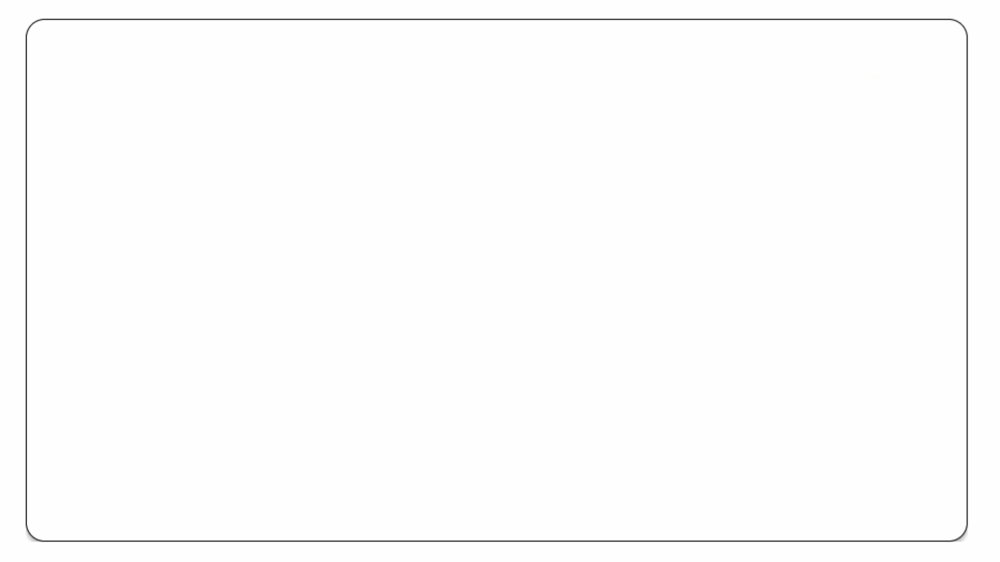

# Hi, there👋

## 💫 About Me

* **남에게 피해는 끼치지 말자** 라는 원칙 아래, 맡은 일은 끝까지 책임지는 팀원이 되기를 지향합니다.

## 🛠️Skills

* Languages: **Python**, Java, **C/C++**, Scala, Ocaml
* Frontend: CSS, React
* Backend: PHP
* System & Architecture: MIPS Assembly
* HDL: Verilog

## 👨‍💻Projects
### Spotify Web API 활용 음악 추천 웹사이트 제작🎵
- 팀원 5명, PM 1명
- OAuth 2.0 인증 연동
- 최근 들은 음악/앨범, 기분, 분위기에 따른 플레이리스트 생성 
- 프로필 설정/ 팔로우 기능
- 기술 스택: React, JavaScript, CSS, PHP, SQL

### 아두이노 키패드 피아노 제작🎹
- 팀원 2명
- 아두이노 우노, 부저, 키패드 등 하드웨어 사용
- 녹음, 재생, 키매핑, 뮤트모드
- 기술 스택: C++

## 📚Education
- 2020.03 ~ 2020.06 성균관대학교 - 경영학과
- 2021.08 ~ 2022.05 Washington State University - Computer Science
- 2022.08 ~ 2025.05 State University of New York at Buffalo - B.S. in Computer Science, Minor in Mathematics

